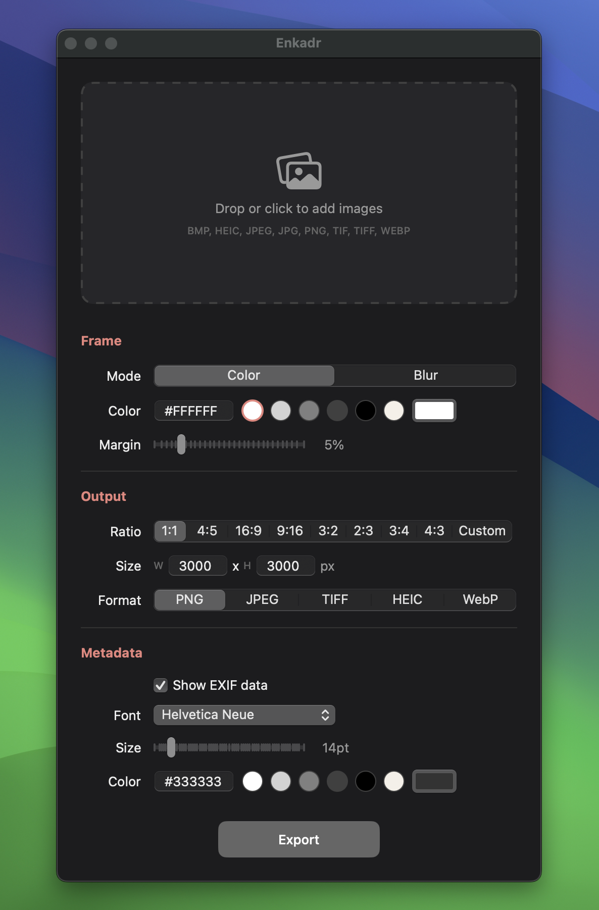

<h1 align="center">Enkadr</h1>

<div align="center">
<p align="center">
  
</p>
<a href="https://github.com/PABourdais/Enkadr/releases/latest/download/Enkadr.dmg">
  
</a>
  <p>
    A lightweight macOS app to add frames and borders to your photos. Built with SwiftUI.
  </p>
</div>

<p align="center">
  
  
</p>

<p align="center">
  
</p>

## Features

- **Custom frames** — Solid color or blurred image background
- **Solid color mode** — Choose any color via hex input, color presets, or the native color picker
- **Blur mode** — Fill the frame with a blurred version of the photo, with a customizable border (size and color)
- **Aspect ratio presets** — 1:1, 4:5, 16:9, 9:16, 3:2, 2:3, 3:4, 4:3, or custom
- **Adjustable margin** — 0–30% slider for precise border control
- **EXIF metadata overlay** — Display camera model, focal length, aperture, and shutter speed on the frame
- **Configurable metadata style** — Choose font family, size, and color
- **Multiple output formats** — PNG, JPEG, TIFF, HEIC, WebP
- **Batch processing** — Drop or select multiple images at once
- **Drag & drop** — Drop images directly into the app
- **Persistent settings** — Preferences are saved between sessions (Cmd+,)
- **EXIF orientation support** — Correctly handles rotated photos

## Supported Input Formats

BMP, HEIC, JPEG, JPG, PNG, TIF, TIFF, WebP

## Install

### From GitHub Releases

1. Download [Enkadr.dmg](https://github.com/PABourdais/Enkadr/releases/latest/download/Enkadr.dmg)
2. Open the `.dmg` file
3. Drag **Enkadr** to your **Applications** folder
4. Launch Enkadr from Applications

> **Note:** On first launch, macOS may show a security warning since the app is not notarized. Go to **System Settings > Privacy & Security** and click **Open Anyway**.

### Build from source

Requires Xcode Command Line Tools and macOS 14+.

```bash
# Build the .app bundle
bash build-app.sh

# Or build the .dmg installer
bash build-dmg.sh
```

The `.app` bundle will be created in the project root. You can copy it to `/Applications/` or double-click to launch.

## Contributing

1. Fork the repository
2. Create a feature branch (`git checkout -b feat/my-feature`)
3. Make your changes and ensure tests pass (`swift test`)
4. Commit your changes with a clear message
5. Push to your fork and open a Pull Request against `main`

All PRs must pass CI checks before being merged. The `main` branch is protected — direct pushes are not allowed.

## Tech Stack

- **SwiftUI** — User interface
- **CoreGraphics** — 16-bit sRGB image rendering
- **CoreImage** — Gaussian blur for blurred frame mode
- **CoreText** — Metadata text overlay
- **ImageIO** — EXIF metadata reading & image encoding
- **Swift Package Manager** — Build system

## License

MIT
